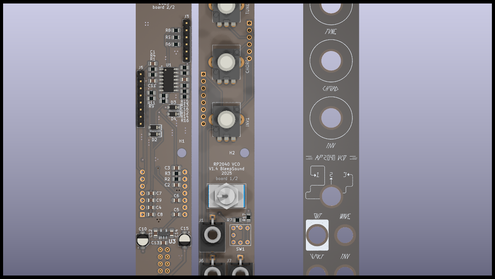
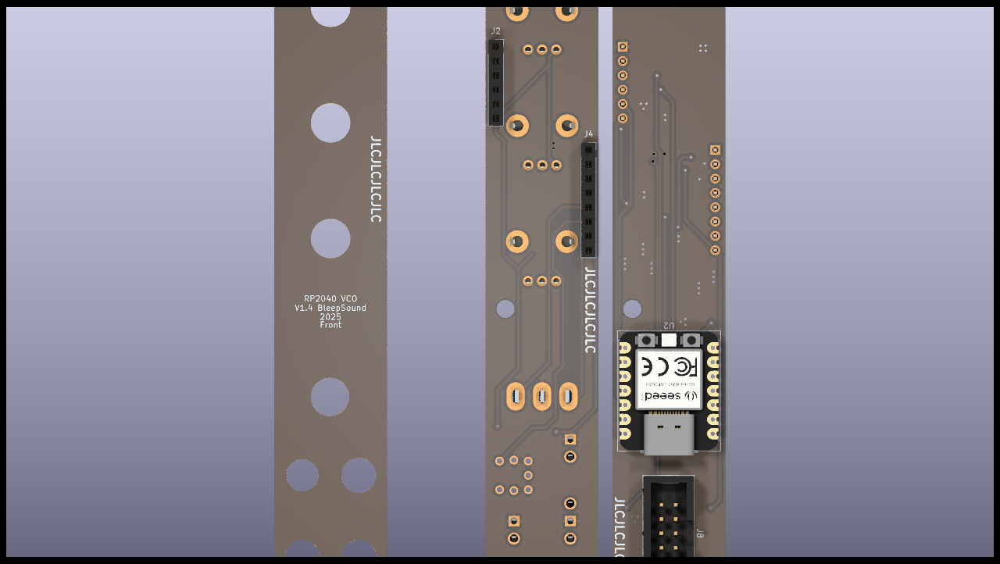
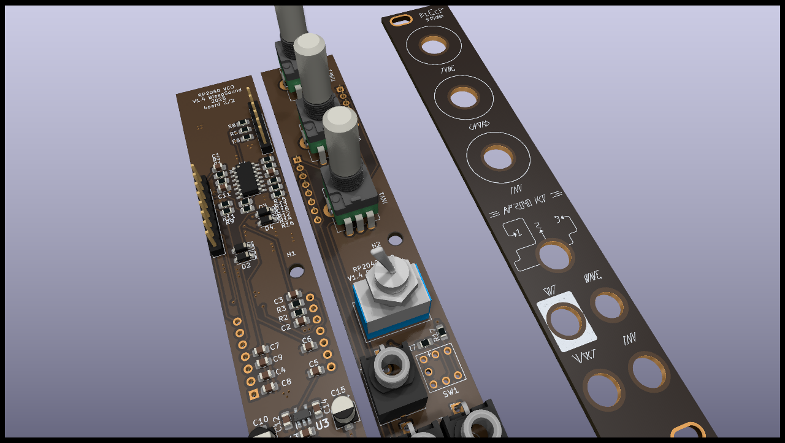

# RP2040 VCO (Clone, made by Hagiwo)

VCO clone, originally made by HAGIWO ([link](https://note.com/solder_state/n/n64b91a171218) in japanese)

RP2040 chord VCO clone in SMD.

5-polyphonic Chord VCO module.
There are 8 types of tones.
With a built-in quantizer and automatic harmonics function, if you input a suitable CV, it will play a nice chord progression.

**Switch indications:**

You'll notice numbers along the central 3 position switch. The table below explains each position's function. 

| Position |     1    |        2        |          3         |
|----------|:--------:|:---------------:|:------------------:|
| Function | arpeggio | chord with root | chord without root |

## Schematics

## BoM

[See bom](documentation/bom/RP2040-VCO_V1.2--iBoM.html)

## Build Informations

:warning: When building modules, always do it in this order (from smallest component to highest):
- diodes
- resistors
- DIP chips
- capacitors (film/ceramic)
- Electrolytic capacitors

For the next part, always place them without soldering them on: 
- jacks, pots and switches that go throught the front panel

Once placed, put in place the front panel, then fasten all components to it. Once this is done, you can solder them.

### V1.1
- you HAVE TO rotate SW1 180° for the built in LED to work.
- Issues on front panel (wrong label and missing info)

### V1.2
 - Fix issues on SW1
 - Update front panel look to include all informations

## Images

## Software

You'll find the software for that module in the soft folder.

The microcontroler model is: **Seeed XIAO RP2040**

To flash it, use a usb-c cable to connect the RP2040 to your computer and use the arduino IDE (or your preferred IDE) to flash the microcontroler.

If you need any help, you can find a tutorial on how to flash a software via arduino onto a RP2040 [here](https://wiki.seeedstudio.com/XIAO-RP2040-with-Arduino/).